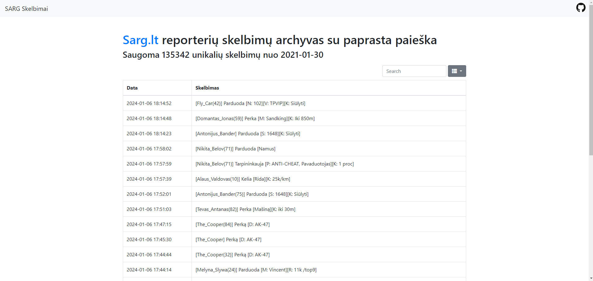

# Sarg.lt reporters ad scraper/archive

# Setup

1. Clone this repository
2. `$ ./tools/prepare.sh`
3. You can import `data.sql` into MySQL. There are data from 2021-01-30 to 2023-08-06.

# Commands

1. `bin/console app:sync` Downloads the ads, scrapes them and stores them in database
